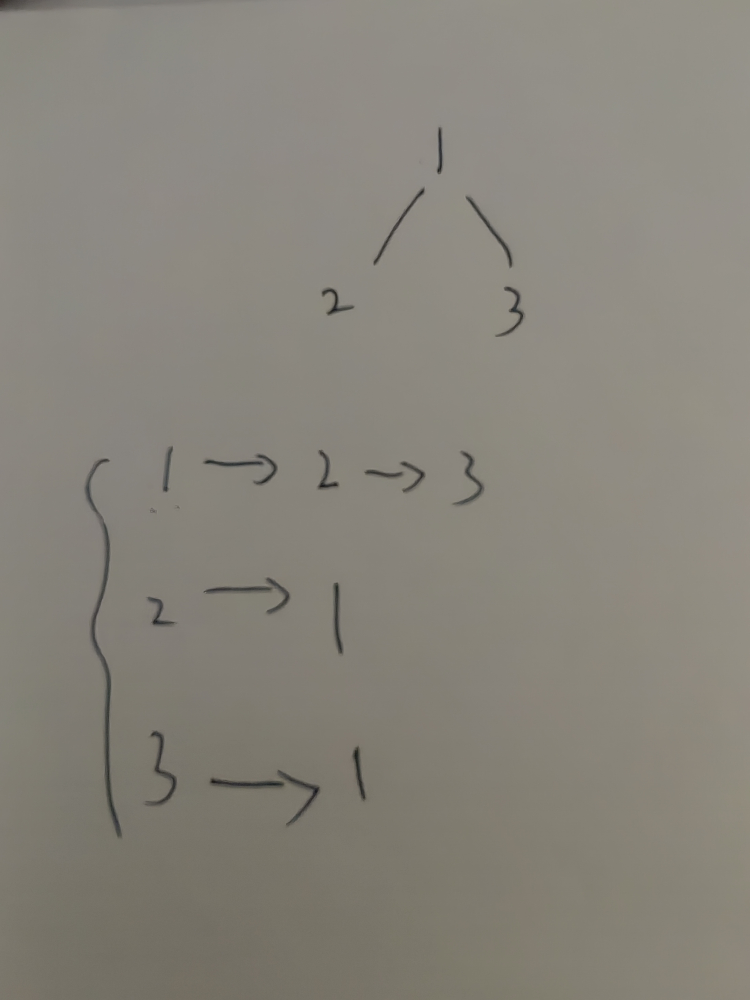

__摘要：__
使用邻接表建图并递归遍历图。
<!-- more -->

### 题目
给定一颗树，树中包含 $n$ 个结点（编号 $1∼n$）和 $n−1$ 条无向边。

请你找到树的重心，并输出将重心删除后，剩余各个连通块中点数的最大值。

重心定义：重心是指树中的一个结点，如果将这个点删除后，剩余各个连通块中点数的最大值最小，那么这个节点被称为树的重心。

__输入格式__
第一行包含整数 $n$，表示树的结点数。

接下来 $n−1$ 行，每行包含两个整数 $a$ 和 $b$，表示点 $a$ 和点 $b$ 之间存在一条边。

__输出格式__
输出一个整数 $m$，表示将重心删除后，剩余各个连通块中点数的最大值。

__数据范围__
$1≤n≤10^5$

__输入样例__
> 9
> 1 2
> 1 7
> 1 4
> 2 8
> 2 5
> 4 3
> 3 9
> 4 6

__输出样例：__
> 4

### 代码


<!-- tab C++ -->
```c++
/**
 * author: zxy
 * code at: 2023-9-2 17:28:21
 */
#include <bits/stdc++.h>
#define __nullptr__ -1
using namespace std;

const int N = 1e5 + 10;
const int M = 2 * N;
int n;
int h[N], e[M], ne[M], idx;
bool st[N];
int res = M;


void link(int a, int b)
{
    e[idx] = b, ne[idx] = h[a], h[a] = idx++;
}

int dfs(int node_val)
{
    st[node_val] = true;
    // all_child_cnt: all child points cnt of current node
    // max_child_cnt: max child points cnt of current node
    int max_child_cnt = 0, all_child_cnt = 0;
    for (int i = h[node_val]; i != -1; i = ne[i])
    {
        int child_val = e[i];
        if (st[child_val]) continue;
        int one_child_cnt = dfs(child_val);
        max_child_cnt = max(max_child_cnt, one_child_cnt);
        all_child_cnt += one_child_cnt;
    }
    
    // when all childs processed or no child processed, returns 
    // compares the max child point cnt with remain node cnt(parent nodes)
    int max_cnt_of_all_parts = max(max_child_cnt, n - all_child_cnt - 1);
    res = min(res, max_cnt_of_all_parts);
    return all_child_cnt + 1;
}

int main()
{
    memset(h, __nullptr__, sizeof h);
    cin >> n;
    for (int cnt = n - 1; cnt--;) 
    {
        int a, b;
        cin >> a >> b;
        link(a, b), link(b, a);
    }
    dfs(1);
    cout << res << endl;
}
```
<!-- endtab -->

<!-- tab Java -->
```java

```
<!-- endtab -->


### 理解
我们使用邻接表构件图。如图：

维护一个数组，下标表示图中每个节点的值，数组每个下标对应一个链表结构，维护下标节点的所有相邻节点。

本题建图的过程中，对于每组节点 $a,b$，我们分别以 $a$ 为起点构建到 $b$ 的边，以及以 $b$ 为起点构建到 $a$ 的边。在该过程中会分别在 $a$ 和 $b$ 的下标处使用头插法向链表中插入 $b$ 和 $a$。

根据题目描述，存在一个节点，去除之后剩余各部分节点数的最大值最小。求这个节点以及最小的连通块节点数量。

核心思想是对每个节点求解一遍去除自身节点后的剩余连通块最大值，并相互比较取最小值。

使用DFS遍历图，对于某节点 $a$，我们的遍历顺序是为其每个孩子节点进行一次向下递归搜索。当从遍历到达叶子结点后开始回溯，在回溯过程中，可以得到回溯经过的节点的所有孩子节点数量，并向上返回。最终回到节点 $a$ 时，我们可以得到所有直系孩子连通块的节点数量，并比较得出最大值。

值得注意的是，对于该节点 $a$，它的所有直接连通块除了所有孩子连通块外，还有父连通块。因为我们知道所有节点数量，故可简单使用总数减去所有孩子连通块节点总数得到父连通块的节点数量。

这样，对于节点 $a$，我们知道了所有连通块的节点数量，可以取最大值，并维护起来，方便与其他节点进行比较，取最小值即可。

另外，代码开数组时，注意下标取值范围。节点数范围为 $1≤n≤10^5$，建图过程中，对于$a,b$ 两点会分别连接 $a$ 到 $b$ 和 $b$ 到 $a$。
在该过程中，$h$ 数组下标对应 $a$ 和 $b$ 及其他节点的值，范围始终在 $n$ 内，所以 $h$ 数组大小取 $10^5 + 10$ 即可；
然而 $e$ 数组和 $ne$ 数组下标对应 $idx$，因为每两点构建两次边，所以 $idx$ 一直向后递增总数翻倍，故 $e$ 和 $ne$ 的下标范围取 $2$ 倍的 $10^5 + 10$.



__原题链接：__ [AcWing 846. 树的重心](https://www.acwing.com/problem/content/848/)
